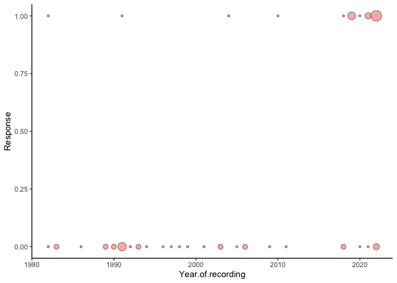

humei
================
Trevor
2025-08-20

This is an [R Markdown](http://rmarkdown.rstudio.com) Notebook. When you
execute code within the notebook, the results appear beneath the code.

Try executing this chunk by clicking the *Run* button within the chunk
or by placing your cursor inside it and pressing *Cmd+Shift+Enter*.

``` r
library(lme4)
```

    ## Loading required package: Matrix

``` r
playbk<-read.csv("~/Desktop/current does/currentpapersgrants/humei Call Notes/VigneshPlaybacks/Vigplayback.csv")
recordings<-read.csv("~/Desktop/current does/currentpapersgrants/humei Call Notes/VigneshPlaybacks/Humei_Recording.csv")
str(playbk)
```

    ## 'data.frame':    82 obs. of  4 variables:
    ##  $ Location                : chr  "Bharatpur" "Bharatpur" "Bharatpur" "Bharatpur" ...
    ##  $ Recording.ID.Number     : int  1 112 8 2 111 98 17 102 10 113 ...
    ##  $ Total.score.out.of.three: int  3 2 0 0 2 3 0 3 0 0 ...
    ##  $ Playback                : int  1 1 2 2 3 4 4 5 5 6 ...

``` r
str(recordings)
```

    ## 'data.frame':    216 obs. of  14 variables:
    ##  $ Recording.ID.Number        : int  1 2 3 4 5 6 7 8 9 10 ...
    ##  $ Call.ID                    : chr  "0000820504_41935ML Phylloscopus humei India Ben King_1982.Table.4.selections_8splits.txt" "00008302xx_Netherlands_Cornelius_P. humei_022A-WS4368XXXXXX-0101M0_1.Table.3.selections_8splits.txt" "00008306xx_Kyrgystan_Svensson_P. humei_022A-WS4368XXXXXX-0107M0_2.Table.3.selections_8splits.txt" "00008602xx_Bharatpur_Hansen_P. humei_022A-WS4368XXXXXX-0104M0_3.Table.3.selections_8splits.txt" ...
    ##  $ Figure.placement.under.year: chr  "82-1" "83-1, 83-2" "83-3, 83-4" "86-1,2,3,4" ...
    ##  $ Year                       : int  1982 1983 1983 1986 1986 1986 1986 1989 1989 1990 ...
    ##  $ YearEA                     : chr  "1982" "1983" "1983" "1986" ...
    ##  $ location                   : chr  "Baramula" "Netherlands" "Ala Archa National Park ?" "Bharatpur" ...
    ##  $ latitude                   : num  34.2 NA 41.2 27.2 27.2 ...
    ##  $ longitude                  : num  74.3 NA 74.8 77.5 77.5 ...
    ##  $ state                      : chr  "Jammu&Kashmir" "Netherlands" "Kyrgystan" "Rajasthan" ...
    ##  $ country                    : chr  "India" "Netherlands" "" "India" ...
    ##  $ date                       : chr  "May" "February" "June" "February" ...
    ##  $ X                          : chr  "Ben King" "Cornelius" "Svensson??" "Hansen" ...
    ##  $ X.1                        : chr  "ML" "NSA" "NSA" "NSA" ...
    ##  $ X.2                        : chr  "" "" "" "" ...

``` r
play<-merge(playbk,recordings)
play<-play[!duplicated(play), ]
play<-data.frame(play[,1:4], play$Year)
fit_zipoisson <- glmer(Total.score.out.of.three~play.Year+(1|Recording.ID.Number)+(1|Playback),data=play,family=poisson)
```

    ## boundary (singular) fit: see help('isSingular')

``` r
summary(fit_zipoisson)
```

    ## Warning in vcov.merMod(object, use.hessian = use.hessian): variance-covariance matrix computed from finite-difference Hessian is
    ## not positive definite or contains NA values: falling back to var-cov estimated from RX

    ## Warning in vcov.merMod(object, correlation = correlation, sigm = sig): variance-covariance matrix computed from finite-difference Hessian is
    ## not positive definite or contains NA values: falling back to var-cov estimated from RX

    ## Generalized linear mixed model fit by maximum likelihood (Laplace
    ##   Approximation) [glmerMod]
    ##  Family: poisson  ( log )
    ## Formula: Total.score.out.of.three ~ play.Year + (1 | Recording.ID.Number) +  
    ##     (1 | Playback)
    ##    Data: play
    ## 
    ##       AIC       BIC    logLik -2*log(L)  df.resid 
    ##     190.9     201.1     -91.4     182.9        91 
    ## 
    ## Scaled residuals: 
    ##     Min      1Q  Median      3Q     Max 
    ## -0.9968 -0.5694 -0.3449  0.2985  6.2747 
    ## 
    ## Random effects:
    ##  Groups              Name        Variance Std.Dev.
    ##  Recording.ID.Number (Intercept) 0.0000   0.0000  
    ##  Playback            (Intercept) 0.4078   0.6386  
    ## Number of obs: 95, groups:  Recording.ID.Number, 46; Playback, 43
    ## 
    ## Fixed effects:
    ##               Estimate Std. Error z value Pr(>|z|)    
    ## (Intercept) -151.75329   36.38336  -4.171 3.03e-05 ***
    ## play.Year      0.07522    0.01809   4.159 3.20e-05 ***
    ## ---
    ## Signif. codes:  0 '***' 0.001 '**' 0.01 '*' 0.05 '.' 0.1 ' ' 1
    ## 
    ## Correlation of Fixed Effects:
    ##           (Intr)
    ## play.Year -1.000
    ## optimizer (Nelder_Mead) convergence code: 0 (OK)
    ## boundary (singular) fit: see help('isSingular')

``` r
mean(play$Total.score.out.of.three[play$play.Year>2009 & play$play.Year<2015], na.rm=T)
```

    ## [1] 1.1

``` r
mean(play$Total.score.out.of.three[play$play.Year>2015], na.rm=T)
```

    ## [1] 1.214286

Add a new chunk by clicking the *Insert Chunk* button on the toolbar or
by pressing *Cmd+Option+I*.

``` r
library(ggplot2)
library(viridis)
```

    ## Loading required package: viridisLite

``` r
p1<-ggplot(play, aes(x=play.Year,y=Total.score.out.of.three))
p2<-p1+ geom_count(aes(fill="#A4A4A433", alpha=0.5), shape = 21,colour = "black") +stat_smooth(method = "glm", formula = y ~ x, 
  method.args = list(family = "poisson"))
p2 + theme(panel.grid.major = element_blank(), panel.grid.minor = element_blank(),
  panel.background = element_blank(), axis.line = element_line(colour = "black"))+theme(legend.position = "none")
```

<!-- -->

``` r
pratap<-read.csv("~/Desktop/current does/currentpapersgrants/humei Call Notes/VigneshPlaybacks/Pratap_Playbacks.csv")
p1<-ggplot(pratap, aes(x=Year.of.recording,y=Response))
p2<-p1+ geom_count(aes(fill="#A4A4A433", alpha=0.5), shape = 21,colour = "black")
p2 + theme(panel.grid.major = element_blank(), panel.grid.minor = element_blank(),
  panel.background = element_blank(), axis.line = element_line(colour = "black"))+theme(legend.position = "none")
```

<!-- -->

``` r
pratap$recording<-as.factor(pratap$Recording.ID)
fit_bin <- glmer(Response~Year.of.recording+(1|recording)+(1|male),data=pratap,family=binomial)
```

    ## Warning in checkConv(attr(opt, "derivs"), opt$par, ctrl = control$checkConv, :
    ## Model failed to converge with max|grad| = 0.165134 (tol = 0.002, component 1)

    ## Warning in checkConv(attr(opt, "derivs"), opt$par, ctrl = control$checkConv, : Model is nearly unidentifiable: very large eigenvalue
    ##  - Rescale variables?

``` r
x<-seq(-10,10, 0.01) #spatial domain,NOTE: may need to set to 0.001 intervals

result<-as.data.frame(matrix(nrow=100, ncol=4))
colnames(result)<-c("copy_winter","copy_breeding", "dispersal", "generation")

distribution<-as.data.frame(matrix(nrow=length(x), ncol=5))
distribution<-data.frame(distribution,x)
colnames(distribution)<-c("breeding_adults","breeding_copied","winter","winter_copied","fraction_of_space","space")


f.gauss<-function(x) 1/(sqrt(2*pi*sigma^2)) * exp(-x^2/(2*sigma^2))
ab=5; aw=25; sigma=1 #copying parameter breeding, winter, dispersal kernel (bdg and winter)
f.cfab<-function(f) (1-exp(-ab*f))/(1-exp(-ab)) #copying function, breeding season
f.cfaw<-function(f) (1-exp(-aw*f))/(1-exp(-aw)) #copying function, winter season

f.fjx<-function(y) f.cfab(f.fax(y)) #applies copying function to breeding distribution
#f.fjx<-f.fax #this to see what happens if no breeding copying
f.fw <- function(y) {integrate(function(y,x) sb(y)*f.gauss(x-y),-Inf,Inf,y)$value} #distribution of call in winter, applies dispersal function to post copying breeding season
f.fw <- Vectorize(f.fw)
f.fw1<-function(z) f.cfaw(f.fw(z)) #applies copying function to winter distribution
f.fax<- function(y) {integrate(function(y,x) sw(y)*f.gauss(x-y),-Inf,Inf,y, subdivisions = 2000)$value} #breeding
f.fax <- Vectorize(f.fax) 

f.FA<-function(x) ifelse(x>0 & x<1, 0.01, 0) #initial appearance
f.fjAx<-function(y) f.cfab(f.FA(y))
#f.fjAx<-f.FA #no breeding copying
#library(convdistr); conv <- convolve(sw(x),(1/(sqrt(2*pi*sigma^2)) * exp(-x^2/(2*sigma^2))))#this gave same answer as integrate. 

 #initialization
time<-list()
k<-0
for (loop_aw in 2){
  aw<-loop_aw
  for(loop_ab in 1){
    ab<-5 #note. we set no breeding copying above, so this is irrelevant
    for (loop_sigma in c(1:2)){
      sigma<-loop_sigma
    k<-k+1
  
  distribution[,1]<-f.FA(x) #breeding
  distribution[,2]<-f.fjAx(x) #breeding after copying
  sb<-splinefun(x, distribution[,2])
  distribution[,3]<-f.fw(x) #winter
  distribution[,4]<-f.fw1(x) #winter after copying
  distribution[1,5]<-sum(distribution[,4]>0.8)/length(x)
  time[[1]]<-distribution


for (i in 2:30) 
  {sw<-splinefun(x, time[[i-1]][,4])
  distribution[,1]<-f.fax(x) #breeding
  #distribution[,2]<-f.fjx(x) #breeding after copying
  distribution[,2]<-f.fax(x) #breeding no copying
  sb<-splinefun(x, distribution[,2])
  distribution[,3]<-f.fw(x) #winter
  distribution[,4]<-f.fw1(x) #winter after copying
  if(min(distribution[,4]<0)) break
  distribution[1,5]<-sum(distribution[,4]>0.8)/length(x)
  time[[i]]<-distribution
  if(distribution[1,5]>0.33) break}
  
  result[k,]<-c(aw, ab, sigma, i)}}}
  head(result)
```

    ##   copy_winter copy_breeding dispersal generation
    ## 1           2             5         1          9
    ## 2           2             5         2          9
    ## 3          NA            NA        NA         NA
    ## 4          NA            NA        NA         NA
    ## 5          NA            NA        NA         NA
    ## 6          NA            NA        NA         NA

``` r
  write.csv(result, "humei_simulations3.csv")
```

``` r
library(ggpubr)
library(ggplot2)
col1<-rgb(0.368417, 0.506779, 0.709798)
col2<-rgb(0.880722, 0.611041, 0.142051)
col3<-rgb(0.560181, 0.691569, 0.194885)
col4<-rgb(0.922526, 0.385626, 0.209179)
col5<-rgb(0.528488, 0.470624, 0.701351)


plots<-list()
for (j in 1:1){

p1<- ggplot(time[[j]], aes(x=space))
p2<-p1 + geom_line(aes(y=breeding_adults), color=col1) + geom_line(aes(y=breeding_copied), color=col2)
p3<-p2 +geom_line(aes(y=winter), color=col3) +geom_line(aes(y=winter_copied), color=col4)
plots[[j]] <-p3 + theme(panel.grid.major = element_blank(), panel.grid.minor = element_blank(),panel.background = element_blank(), axis.line = element_line(colour = "black"))}
#ggarrange(plots[[1]], plots[[3]], ncol = 2)

plot(time[[1]]$breeding_adults~x, type="l", col="#5E81B5", bty="l", ylim=c(0,1))
```

<!-- -->

``` r
data<-read.csv("humei_simulations.csv")

#disp2<-subset(data, copy_breeding<6 & dispersal==2)
#disp05<-subset(data, copy_breeding<6 & dispersal==0.5)

pal<-c(rainbow(8, alpha = 1, rev = FALSE), "grey","grey","grey", "black", "black", "black")
#plot(disp05$copy_winter~disp05$copy_breeding, pch=16, cex=1.5, col=pal[disp05$generation-1], bty="l", xlim=c(0,5.5), ylab="Copying parameter (a), winter", xlab="Copying parameter (a), ")
#text(disp05$copy_breeding, disp05$copy_winter, as.character(disp05$generation), cex=0.8, col=pal[disp05$generation-1], pos=4)

plot(data$copy_winter~data$dispersal, pch=16, cex=1.5, col=pal[data$generation-1], bty="l", xlim=c(0,2), ylab="Copying parameter, winter", xlab="Dispersal parameter")
text(data$dispersal, data$copy_winter, as.character(data$generation), cex=0.8, col=pal[data$generation-1], pos=4)
```

<!-- -->

When you save the notebook, an HTML file containing the code and output
will be saved alongside it (click the *Preview* button or press
*Cmd+Shift+K* to preview the HTML file).

The preview shows you a rendered HTML copy of the contents of the
editor. Consequently, unlike *Knit*, *Preview* does not run any R code
chunks. Instead, the output of the chunk when it was last run in the
editor is displayed.

()
